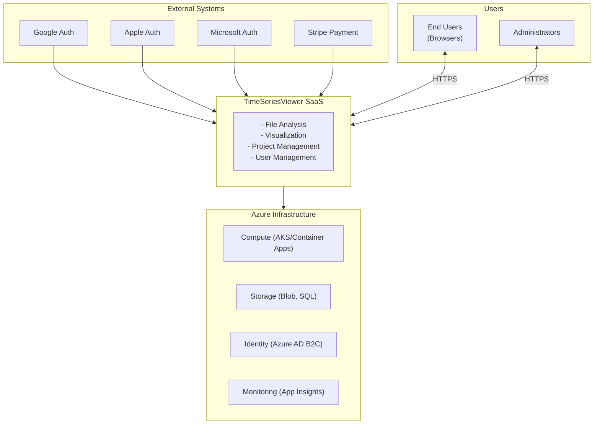
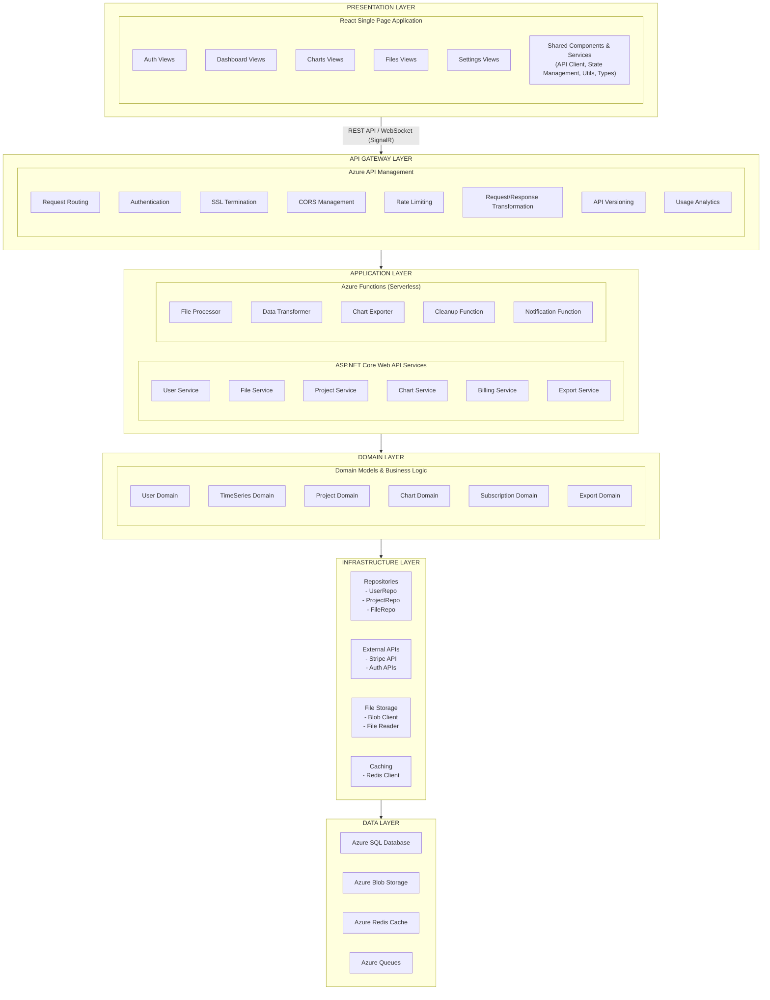
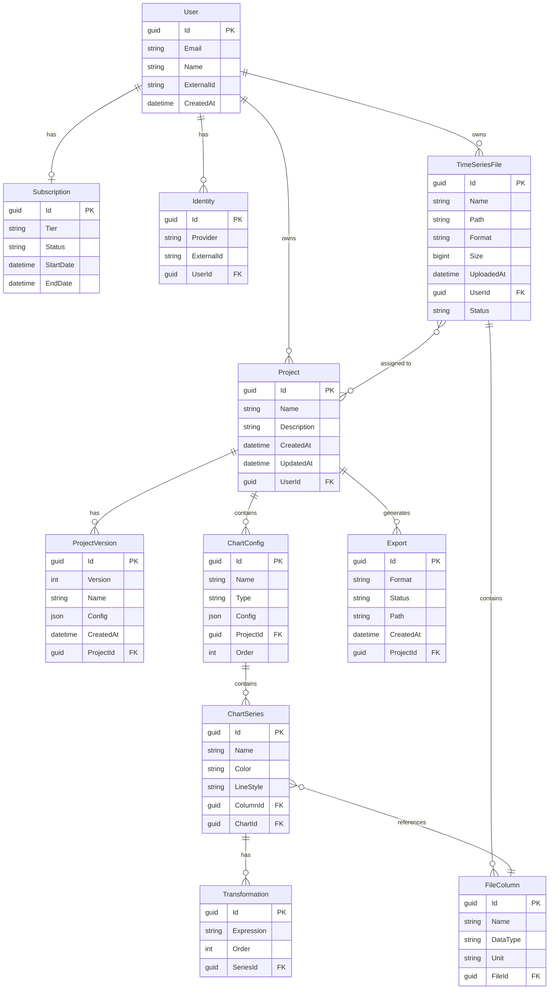
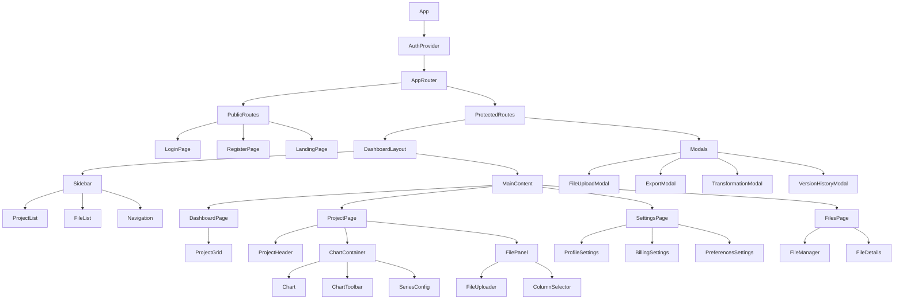
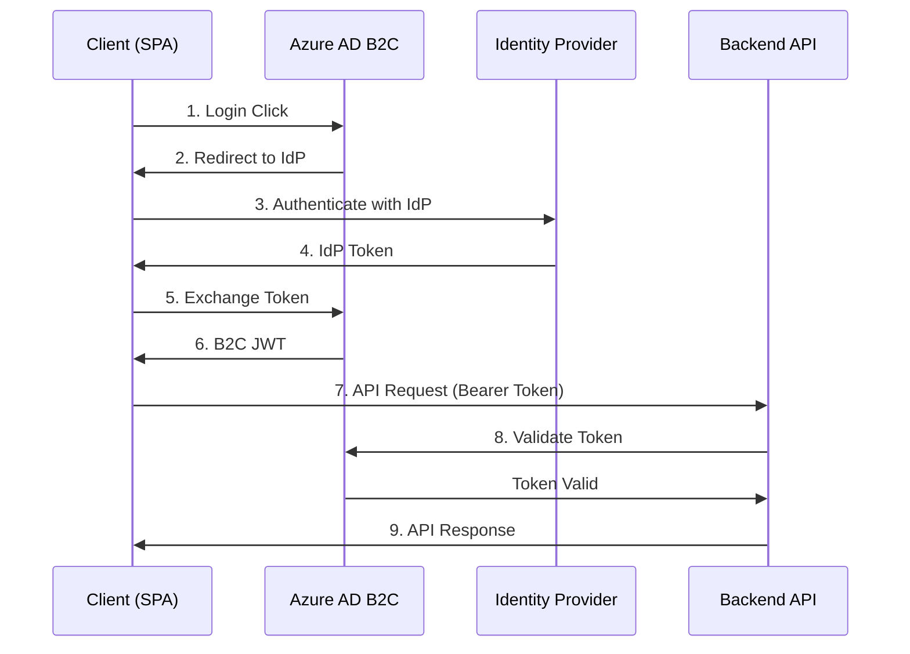
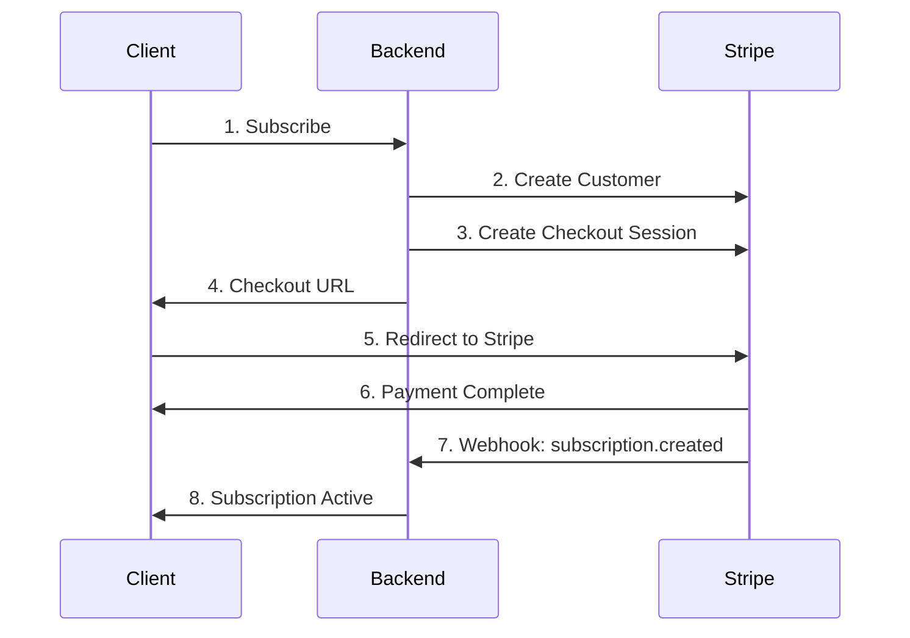
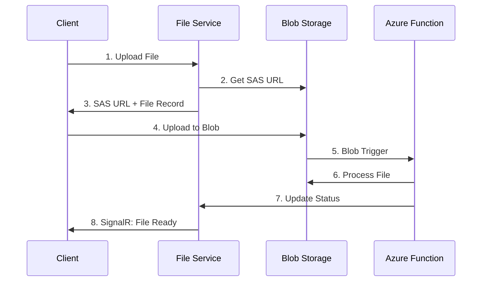
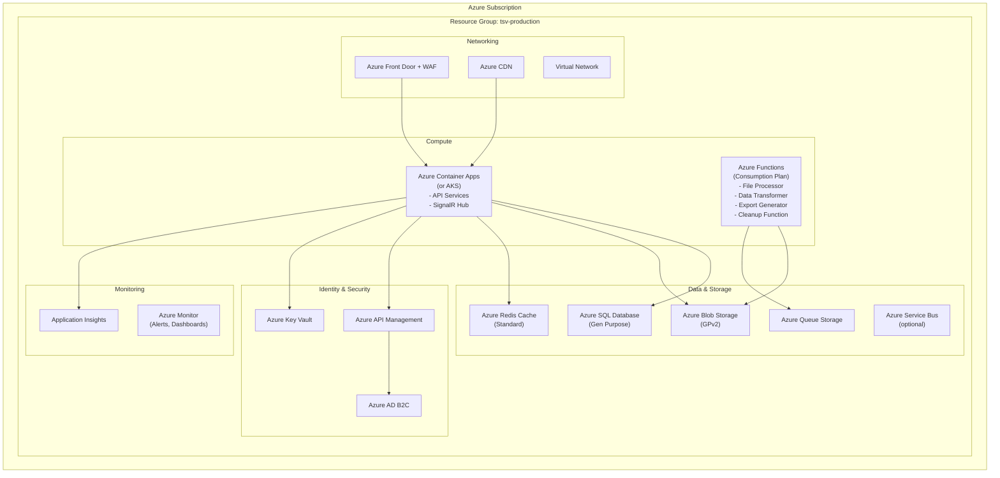
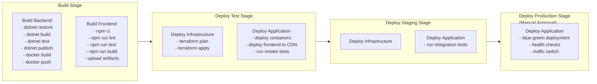
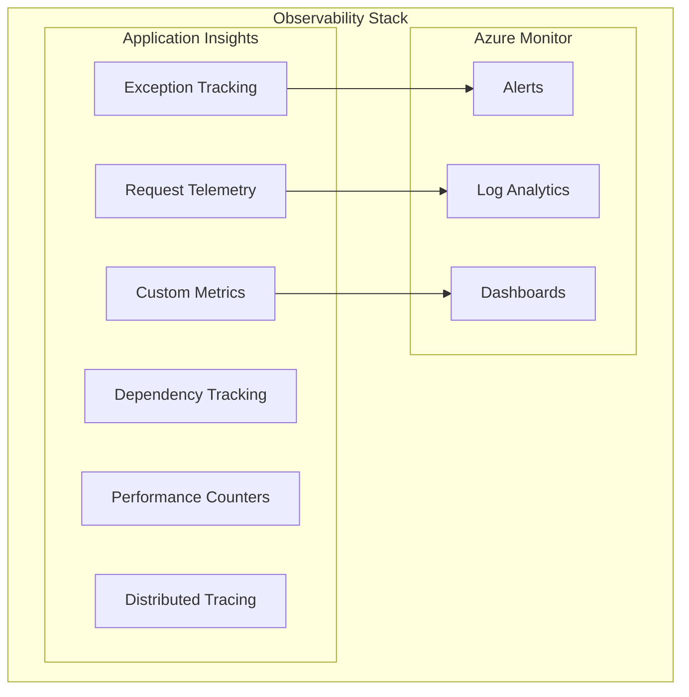

# TimeSeriesViewer SaaS - Solution and Software Architecture

## 1. Introduction

### 1.1 Purpose

This document provides a comprehensive technical architecture for the TimeSeriesViewer SaaS platform.  It serves as the primary reference for development teams, architects, and stakeholders involved in building and maintaining the system. 

### 1.2 Scope

This architecture covers: 
- System context and boundaries
- Logical and physical architecture
- Component design and interactions
- Data architecture and flows
- Security architecture
- Integration patterns
- Deployment architecture

### 1.3 Architectural Principles

1. **Cloud-Native First**: Design for cloud scalability and resilience
2. **API-First**:  All functionality accessible via well-defined APIs
3. **Security by Design**: Security considerations at every layer
4. **Observability**:  Comprehensive logging, monitoring, and tracing
5. **Cost Efficiency**:  Optimize for operational costs
6. **Simplicity**: Favor simple solutions over complex ones

---

## 2. System Context

### 2.1 Context Diagram



### 2.2 Actors

| Actor | Description |
|-------|-------------|
| **End User** | Engineers, analysts, researchers who analyze time series data |
| **Administrator** | System administrators managing users and configurations |
| **External Identity Provider** | OAuth2/OIDC providers (Google, Apple, Microsoft) |
| **Payment Provider** | Stripe for subscription management |

---

## 3. Logical Architecture

### 3.1 Layered Architecture



### 3.2 Domain Model



---

## 4. Component Architecture

### 4.1 Backend Services

#### 4.1.1 User Service

**Responsibilities:**
- User registration and profile management
- External identity provider integration
- User preferences and settings

**Key Operations:**
```
POST   /api/users/register          - Register new user
GET    /api/users/me                - Get current user profile
PUT    /api/users/me                - Update user profile
DELETE /api/users/me                - Delete user account
GET    /api/users/me/preferences    - Get user preferences
PUT    /api/users/me/preferences    - Update user preferences
```

#### 4.1.2 File Service

**Responsibilities:**
- File upload and management
- File format detection and parsing
- Column extraction and metadata

**Key Operations:**
```
POST   /api/files/upload            - Upload new file (multipart)
POST   /api/files/upload/chunk      - Upload file chunk (resumable)
GET    /api/files                   - List user files
GET    /api/files/{id}              - Get file metadata
DELETE /api/files/{id}              - Delete file
GET    /api/files/{id}/columns      - Get file columns
GET    /api/files/{id}/data         - Get file data (paginated)
GET    /api/files/{id}/preview      - Get file preview (first N rows)
```

#### 4.1.3 Project Service

**Responsibilities:**
- Project CRUD operations
- Project versioning
- Project sharing (future)

**Key Operations:**
```
POST   /api/projects                      - Create project
GET    /api/projects                      - List user projects
GET    /api/projects/{id}                 - Get project details
PUT    /api/projects/{id}                 - Update project
DELETE /api/projects/{id}                 - Delete project
POST   /api/projects/{id}/versions        - Create version snapshot
GET    /api/projects/{id}/versions        - List versions
GET    /api/projects/{id}/versions/{ver}  - Get specific version
POST   /api/projects/{id}/restore/{ver}   - Restore to version
```

#### 4.1.4 Chart Service

**Responsibilities:**
- Chart configuration management
- Data aggregation for visualization
- Time axis normalization

**Key Operations:**
```
POST   /api/projects/{id}/charts              - Create chart
GET    /api/projects/{id}/charts              - List project charts
GET    /api/projects/{id}/charts/{chartId}    - Get chart config
PUT    /api/projects/{id}/charts/{chartId}    - Update chart
DELETE /api/projects/{id}/charts/{chartId}    - Delete chart
GET    /api/projects/{id}/charts/{chartId}/data - Get chart data
POST   /api/charts/normalize                   - Normalize time axes
```

#### 4.1.5 Transformation Service

**Responsibilities:**
- Python expression parsing and validation
- Expression execution
- Transformation caching

**Key Operations:**
```
POST   /api/transformations/validate        - Validate expression
POST   /api/transformations/execute         - Execute transformation
POST   /api/transformations/preview         - Preview result (sample)
```

#### 4.1.6 Export Service

**Responsibilities:**
- Chart export to various formats
- Batch export
- Export job management

**Key Operations:**
```
POST   /api/exports                     - Create export job
GET    /api/exports/{id}                - Get export status
GET    /api/exports/{id}/download       - Download exported file
```

#### 4.1.7 Billing Service

**Responsibilities:**
- Subscription management
- Usage tracking
- Stripe integration

**Key Operations:**
```
GET    /api/billing/subscription           - Get current subscription
POST   /api/billing/subscription           - Create subscription
PUT    /api/billing/subscription           - Update subscription
DELETE /api/billing/subscription           - Cancel subscription
GET    /api/billing/invoices               - List invoices
POST   /api/billing/webhook                - Stripe webhook handler
```

### 4.2 Azure Functions

#### 4.2.1 File Processor Function

**Trigger:** Blob Storage (new file upload)

**Responsibilities:**
- Parse uploaded files (CSV, Parquet)
- Extract metadata and schema
- Generate preview data
- Update file status

#### 4.2.2 Data Transformer Function

**Trigger:** Queue message

**Responsibilities:**
- Execute Python transformations on large datasets
- Cache transformed results
- Handle long-running transformations

#### 4.2.3 Export Generator Function

**Trigger:** Queue message

**Responsibilities:**
- Generate chart exports (PNG, PDF)
- Store generated files
- Update export status

#### 4.2.4 Cleanup Function

**Trigger:** Timer (daily)

**Responsibilities:**
- Remove orphaned files
- Clean up expired exports
- Archive old data

### 4.3 Frontend Components

#### 4.3.1 Component Hierarchy



#### 4.3.2 State Management Structure

```typescript
interface AppState {
  // Authentication
  auth: {
    user: User | null;
    isAuthenticated: boolean;
    isLoading: boolean;
  };

  // Projects
  projects: {
    items: Project[];
    currentProject: Project | null;
    isLoading: boolean;
    error: string | null;
  };

  // Files
  files: {
    items: TimeSeriesFile[];
    uploadProgress: Record<string, number>;
    isLoading: boolean;
  };

  // Charts
  charts: {
    items: ChartConfig[];
    activeChartId: string | null;
    chartData: Record<string, ChartData>;
  };

  // UI State
  ui: {
    sidebarOpen: boolean;
    activeModal: string | null;
    theme: 'light' | 'dark';
  };

  // Billing
  billing: {
    subscription: Subscription | null;
    usage: UsageStats;
  };
}
```

---

## 5. Data Architecture

### 5.1 Database Schema

> **Implementation Notes:**
> - Consider using SQL Server's native JSON data type (available in SQL Server 2016+) for JSON columns during implementation
> - Status fields should be implemented using CHECK constraints or lookup tables to ensure data consistency
> - All enumerations should be validated at the application layer with corresponding C# enums

```sql
-- Users and Authentication
CREATE TABLE Users (
    Id UNIQUEIDENTIFIER PRIMARY KEY DEFAULT NEWID(),
    Email NVARCHAR(255) NOT NULL UNIQUE,
    Name NVARCHAR(255),
    CreatedAt DATETIME2 DEFAULT GETUTCDATE(),
    UpdatedAt DATETIME2 DEFAULT GETUTCDATE(),
    IsActive BIT DEFAULT 1
);

CREATE TABLE UserIdentities (
    Id UNIQUEIDENTIFIER PRIMARY KEY DEFAULT NEWID(),
    UserId UNIQUEIDENTIFIER NOT NULL REFERENCES Users(Id),
    Provider NVARCHAR(50) NOT NULL, -- 'google', 'apple', 'microsoft'
    ExternalId NVARCHAR(255) NOT NULL,
    UNIQUE(Provider, ExternalId)
);

CREATE TABLE UserPreferences (
    UserId UNIQUEIDENTIFIER PRIMARY KEY REFERENCES Users(Id),
    Theme NVARCHAR(20) DEFAULT 'light',
    DefaultChartType NVARCHAR(50) DEFAULT 'line',
    Preferences NVARCHAR(MAX) -- JSON for extensibility
);

-- Subscriptions
CREATE TABLE Subscriptions (
    Id UNIQUEIDENTIFIER PRIMARY KEY DEFAULT NEWID(),
    UserId UNIQUEIDENTIFIER NOT NULL REFERENCES Users(Id),
    StripeCustomerId NVARCHAR(255),
    StripeSubscriptionId NVARCHAR(255),
    Tier NVARCHAR(50) NOT NULL, -- 'free', 'professional', 'team', 'enterprise'
    Status NVARCHAR(50) NOT NULL, -- 'active', 'canceled', 'past_due'
    StartDate DATETIME2 NOT NULL,
    EndDate DATETIME2,
    CreatedAt DATETIME2 DEFAULT GETUTCDATE()
);

-- Files
CREATE TABLE TimeSeriesFiles (
    Id UNIQUEIDENTIFIER PRIMARY KEY DEFAULT NEWID(),
    UserId UNIQUEIDENTIFIER NOT NULL REFERENCES Users(Id),
    Name NVARCHAR(255) NOT NULL,
    OriginalName NVARCHAR(255) NOT NULL,
    BlobPath NVARCHAR(500) NOT NULL,
    Format NVARCHAR(50) NOT NULL, -- 'csv', 'parquet', 'excel'
    Size BIGINT NOT NULL,
    RowCount INT,
    Status NVARCHAR(50) DEFAULT 'uploading', -- 'uploading', 'processing', 'ready', 'error'
    ErrorMessage NVARCHAR(MAX),
    UploadedAt DATETIME2 DEFAULT GETUTCDATE(),
    ProcessedAt DATETIME2
);

CREATE TABLE FileColumns (
    Id UNIQUEIDENTIFIER PRIMARY KEY DEFAULT NEWID(),
    FileId UNIQUEIDENTIFIER NOT NULL REFERENCES TimeSeriesFiles(Id),
    Name NVARCHAR(255) NOT NULL,
    DataType NVARCHAR(50) NOT NULL, -- 'datetime', 'numeric', 'string'
    IsTimestamp BIT DEFAULT 0,
    Unit NVARCHAR(50),
    MinValue FLOAT,
    MaxValue FLOAT,
    NullCount INT DEFAULT 0,
    [Order] INT NOT NULL
);

-- Projects
CREATE TABLE Projects (
    Id UNIQUEIDENTIFIER PRIMARY KEY DEFAULT NEWID(),
    UserId UNIQUEIDENTIFIER NOT NULL REFERENCES Users(Id),
    Name NVARCHAR(255) NOT NULL,
    Description NVARCHAR(MAX),
    CreatedAt DATETIME2 DEFAULT GETUTCDATE(),
    UpdatedAt DATETIME2 DEFAULT GETUTCDATE(),
    IsArchived BIT DEFAULT 0
);

CREATE TABLE ProjectFiles (
    ProjectId UNIQUEIDENTIFIER NOT NULL REFERENCES Projects(Id),
    FileId UNIQUEIDENTIFIER NOT NULL REFERENCES TimeSeriesFiles(Id),
    AddedAt DATETIME2 DEFAULT GETUTCDATE(),
    PRIMARY KEY (ProjectId, FileId)
);

CREATE TABLE ProjectVersions (
    Id UNIQUEIDENTIFIER PRIMARY KEY DEFAULT NEWID(),
    ProjectId UNIQUEIDENTIFIER NOT NULL REFERENCES Projects(Id),
    VersionNumber INT NOT NULL,
    Name NVARCHAR(255),
    Description NVARCHAR(MAX),
    Configuration NVARCHAR(MAX) NOT NULL, -- JSON snapshot
    CreatedAt DATETIME2 DEFAULT GETUTCDATE(),
    UNIQUE(ProjectId, VersionNumber)
);

-- Charts
CREATE TABLE Charts (
    Id UNIQUEIDENTIFIER PRIMARY KEY DEFAULT NEWID(),
    ProjectId UNIQUEIDENTIFIER NOT NULL REFERENCES Projects(Id),
    Name NVARCHAR(255) NOT NULL,
    ChartType NVARCHAR(50) DEFAULT 'line',
    Configuration NVARCHAR(MAX), -- JSON for chart-specific settings
    [Order] INT DEFAULT 0,
    CreatedAt DATETIME2 DEFAULT GETUTCDATE(),
    UpdatedAt DATETIME2 DEFAULT GETUTCDATE()
);

CREATE TABLE ChartSeries (
    Id UNIQUEIDENTIFIER PRIMARY KEY DEFAULT NEWID(),
    ChartId UNIQUEIDENTIFIER NOT NULL REFERENCES Charts(Id),
    ColumnId UNIQUEIDENTIFIER NOT NULL REFERENCES FileColumns(Id),
    Name NVARCHAR(255),
    Color NVARCHAR(20),
    LineStyle NVARCHAR(50) DEFAULT 'solid',
    IsVisible BIT DEFAULT 1,
    [Order] INT DEFAULT 0
);

CREATE TABLE Transformations (
    Id UNIQUEIDENTIFIER PRIMARY KEY DEFAULT NEWID(),
    SeriesId UNIQUEIDENTIFIER NOT NULL REFERENCES ChartSeries(Id),
    Expression NVARCHAR(MAX) NOT NULL,
    [Order] INT DEFAULT 0,
    IsEnabled BIT DEFAULT 1,
    CreatedAt DATETIME2 DEFAULT GETUTCDATE()
);

-- Exports
CREATE TABLE Exports (
    Id UNIQUEIDENTIFIER PRIMARY KEY DEFAULT NEWID(),
    ProjectId UNIQUEIDENTIFIER NOT NULL REFERENCES Projects(Id),
    ChartId UNIQUEIDENTIFIER REFERENCES Charts(Id),
    Format NVARCHAR(20) NOT NULL, -- 'png', 'pdf', 'svg'
    Status NVARCHAR(50) DEFAULT 'pending', -- 'pending', 'processing', 'completed', 'failed'
    BlobPath NVARCHAR(500),
    ExpiresAt DATETIME2,
    CreatedAt DATETIME2 DEFAULT GETUTCDATE()
);

-- Indexes
CREATE INDEX IX_TimeSeriesFiles_UserId ON TimeSeriesFiles(UserId);
CREATE INDEX IX_Projects_UserId ON Projects(UserId);
CREATE INDEX IX_Charts_ProjectId ON Charts(ProjectId);
CREATE INDEX IX_ChartSeries_ChartId ON ChartSeries(ChartId);
CREATE INDEX IX_FileColumns_FileId ON FileColumns(FileId);
```

### 5.2 Blob Storage Structure

```
timeseriesviewer-storage/
├── raw/                          # Original uploaded files
│   └── {userId}/
│       └── {fileId}/
│           └── {originalFileName}
│
├── processed/                    # Processed/optimized data
│   └── {userId}/
│       └── {fileId}/
│           ├── metadata.json
│           ├── schema.json
│           └── data.parquet
│
├── exports/                      # Generated exports
│   └── {userId}/
│       └── {exportId}/
│           └── {filename}.{format}
│
├── cache/                        # Transformation cache
│   └── {userId}/
│       └── {hash}/
│           └── result.parquet
│
└── temp/                         # Temporary upload chunks
    └── {uploadId}/
        └── chunk_{n}
```

### 5.3 Cache Strategy

```
Redis Cache Structure:
├── session:{sessionId}           # User session data (TTL: 24h)
├── user:{userId}                 # User profile cache (TTL: 1h)
├── project:{projectId}           # Project metadata cache (TTL: 30m)
├── file:{fileId}: schema          # File schema cache (TTL: 1h)
├── chart:{chartId}:data:{hash}   # Chart data cache (TTL: 15m)
├── transform:{hash}              # Transformation result cache (TTL: 1h)
└── ratelimit:{userId}            # Rate limiting counters (TTL: 1m)
```

---

## 6. Security Architecture

### 6.1 Authentication Flow



### 6.2 Authorization Model

```csharp
// Role-based authorization
public enum UserRole
{
    User,           // Standard user
    TeamAdmin,      // Team/organization admin
    SystemAdmin     // Platform admin
}

// Resource-based authorization
public enum Permission
{
    // Project permissions
    ProjectRead,
    ProjectWrite,
    ProjectDelete,
    ProjectShare,

    // File permissions
    FileUpload,
    FileRead,
    FileDelete,

    // Export permissions
    ExportCreate,
    ExportDownload
}

// Subscription-based limits
public class SubscriptionLimits
{
    public int MaxFiles { get; set; }
    public long MaxStorageBytes { get; set; }
    public int MaxProjects { get; set; }
    public int MaxChartsPerProject { get; set; }
    public bool CanExport { get; set; }
    public bool CanVersion { get; set; }
    public string[] AllowedExportFormats { get; set; }
}
```

### 6.3 Security Controls

| Layer | Control | Implementation |
|-------|---------|----------------|
| **Network** | DDoS Protection | Azure DDoS Protection Standard |
| **Network** | WAF | Azure Front Door WAF |
| **Transport** | Encryption | TLS 1.3, HTTPS only |
| **API** | Authentication | JWT Bearer tokens |
| **API** | Rate Limiting | Azure API Management |
| **Data** | Encryption at Rest | Azure Storage encryption |
| **Data** | Encryption in Transit | TLS for all connections |
| **Secrets** | Management | Azure Key Vault |
| **Code** | Vulnerability Scanning | GitHub Dependabot, Snyk |
| **Compliance** | GDPR | Data residency, right to deletion |

---

## 7. Integration Architecture

### 7.1 Payment Integration (Stripe)



### 7.2 File Processing Pipeline



---

## 8. Deployment Architecture

### 8.1 Azure Resource Architecture



### 8.2 Environment Strategy

| Environment | Purpose | Configuration |
|-------------|---------|---------------|
| **Development** | Local development | Docker Compose, local emulators |
| **Test** | Automated testing | Minimal Azure resources |
| **Staging** | Pre-production validation | Production-like, smaller scale |
| **Production** | Live service | Full scale, HA configuration |

### 8.3 CI/CD Pipeline



```yaml
# High-level pipeline structure
stages:
  - stage: Build
    jobs:
      - job: BuildBackend
        steps:
          - dotnet restore
          - dotnet build
          - dotnet test
          - dotnet publish
          - docker build
          - docker push

      - job: BuildFrontend
        steps:
          - npm ci
          - npm run lint
          - npm run test
          - npm run build
          - upload artifacts

  - stage: DeployTest
    dependsOn: Build
    jobs:
      - job: DeployInfrastructure
        steps:
          - terraform plan
          - terraform apply

      - job: DeployApplication
        steps:
          - deploy containers
          - deploy frontend to CDN
          - run smoke tests

  - stage: DeployStaging
    dependsOn: DeployTest
    jobs:
      - job: Deploy
        steps:
          - same as test
          - run integration tests

  - stage: DeployProduction
    dependsOn: DeployStaging
    condition: manual
    jobs:
      - job: Deploy
        steps:
          - blue-green deployment
          - health checks
          - traffic switch
```

---

## 9. Monitoring and Observability

### 9.1 Monitoring Strategy



### 9.2 Key Metrics

| Category | Metric | Alert Threshold |
|----------|--------|-----------------|
| **Availability** | Uptime % | < 99.9% |
| **Performance** | P95 Response Time | > 500ms |
| **Performance** | P99 Response Time | > 2s |
| **Errors** | Error Rate | > 1% |
| **Errors** | 5xx Error Count | > 10/min |
| **Saturation** | CPU Usage | > 80% |
| **Saturation** | Memory Usage | > 85% |
| **Business** | Active Users | N/A |
| **Business** | File Uploads | N/A |
| **Business** | Failed Payments | > 0 |

### 9.3 Logging Strategy

```csharp
// Structured logging with Serilog
Log.Information(
    "File processed successfully.  FileId: {FileId}, Size:  {Size}, Duration: {Duration}ms",
    fileId,
    fileSize,
    processingDuration
);

// Log levels
- Verbose:  Detailed debugging information
- Debug: Development-time diagnostics
- Information: General operational events
- Warning: Abnormal or unexpected events
- Error:  Errors and exceptions
- Fatal: Critical failures
```

---

## 10. Scalability Considerations

### 10.1 Horizontal Scaling

| Component | Scaling Strategy |
|-----------|------------------|
| **API Services** | Auto-scale based on CPU/requests |
| **Azure Functions** | Automatic (consumption plan) |
| **Azure SQL** | Read replicas, elastic pools |
| **Redis Cache** | Cluster mode |
| **Blob Storage** | Inherently scalable |

### 10.2 Performance Optimizations

1. **Database**
   - Connection pooling
   - Query optimization and indexing
   - Read replicas for reporting

2. **Caching**
   - Multi-level caching (memory + Redis)
   - Cache invalidation strategies
   - Cache warming for common data

3. **File Processing**
   - Streaming for large files
   - Parallel processing
   - Chunked uploads

4. **Frontend**
   - Code splitting
   - Lazy loading
   - Service worker caching
   - Virtual scrolling for large datasets

---

## 11. Disaster Recovery

### 11.1 Backup Strategy

| Resource | Backup Frequency | Retention | RTO |
|----------|------------------|-----------|-----|
| Azure SQL | Point-in-time (continuous) | 35 days | 1 hour |
| Blob Storage | Soft delete + versioning | 30 days | 1 hour |
| Key Vault | Soft delete | 90 days | 4 hours |

### 11.2 Recovery Procedures

1. **Database Recovery**
   - Point-in-time restore
   - Geo-restore from backup

2. **Application Recovery**
   - Redeploy from CI/CD
   - Configuration from Key Vault

3. **Data Recovery**
   - Restore from blob snapshots
   - Recover deleted items from soft delete

---

## 12. Summary

This architecture provides a solid foundation for the TimeSeriesViewer SaaS platform: 

- **Scalable**:  Designed to handle growth from MVP to enterprise scale
- **Secure**: Multiple layers of security and compliance measures
- **Observable**: Comprehensive monitoring and alerting
- **Maintainable**: Clean separation of concerns and modular design
- **Cost-Efficient**: Pay-per-use services and optimization strategies

The architecture can be implemented incrementally, starting with core functionality and adding advanced features as the product matures. 
