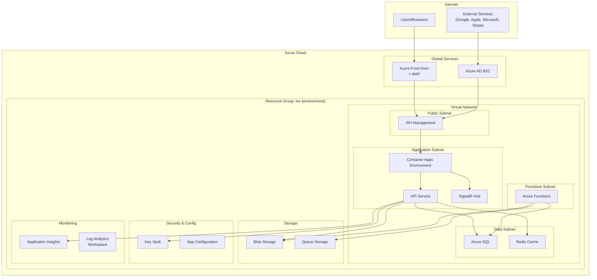
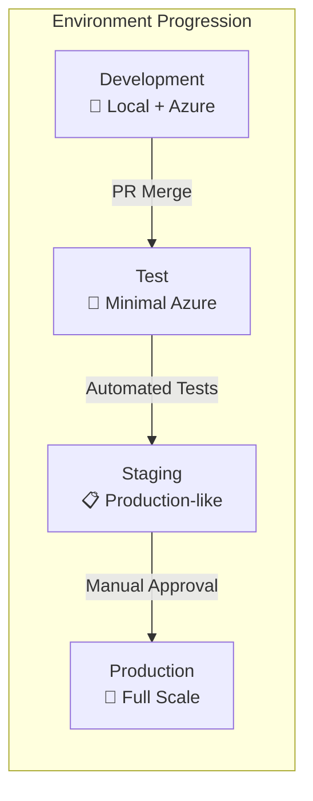
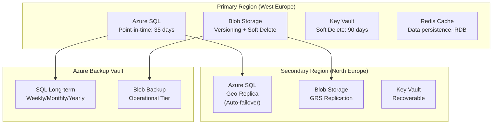
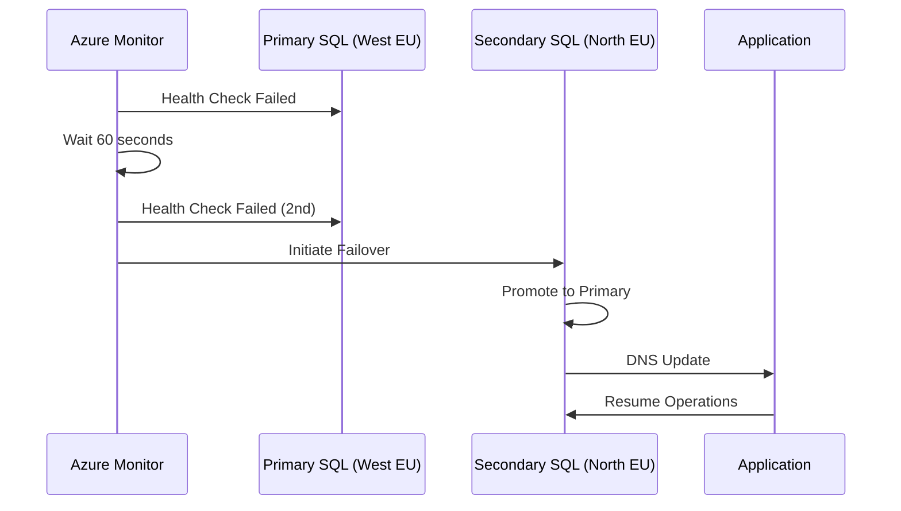
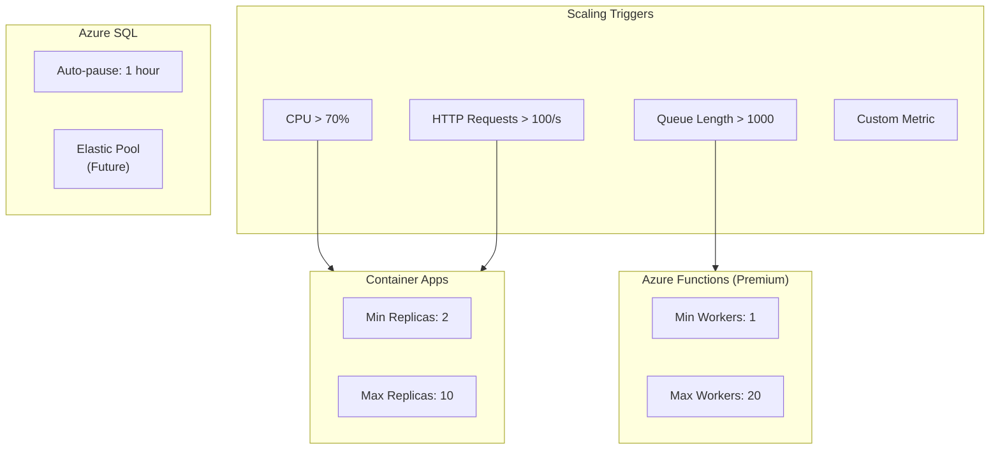
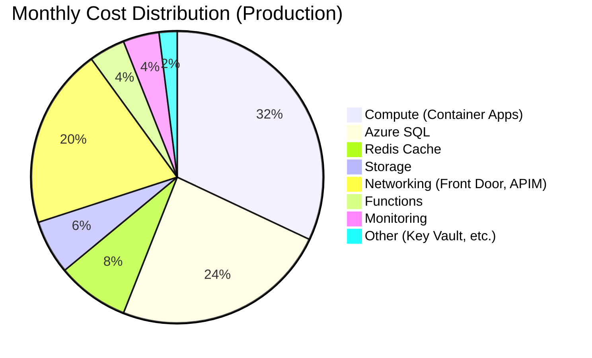
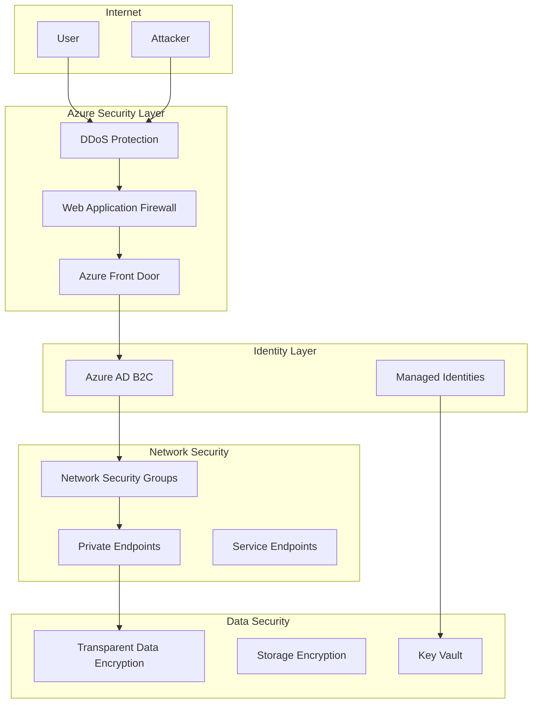
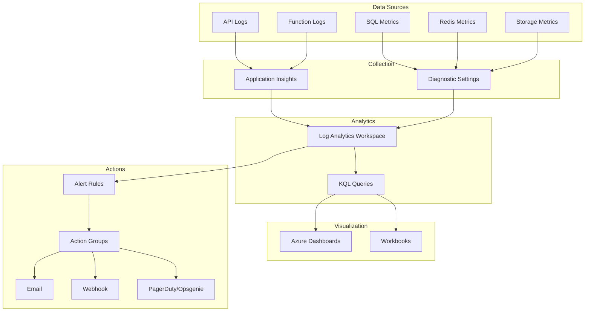
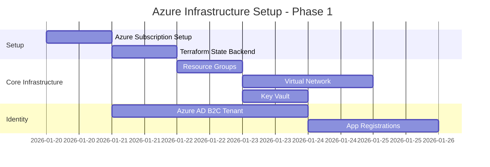

# TimeSeriesViewer - Azure Setup and Deployment Plan

## 1. Executive Summary

This document outlines a comprehensive Azure infrastructure setup plan for the TimeSeriesViewer SaaS application. The plan focuses on cost-efficient, backup-friendly, easily recoverable, and scalable infrastructure using Infrastructure as Code (Terraform).

### 1.1 Key Design Principles

| Principle | Implementation |
|-----------|----------------|
| **Infrastructure as Code** | All resources defined in Terraform for reproducibility |
| **Environment Parity** | Dev/Staging/Production share the same architecture |
| **Cost Efficiency** | Right-sized resources, auto-scaling, tiered storage |
| **High Availability** | Multi-zone deployment, automated failover |
| **Security First** | Zero-trust networking, encryption everywhere |
| **Observability** | Centralized logging, monitoring, and alerting |

---

## 2. Infrastructure Architecture Overview

### 2.1 High-Level Architecture



### 2.2 Resource Inventory

| Resource Type | Service | Purpose |
|--------------|---------|---------|
| **Networking** | Azure Front Door | Global load balancing, WAF, CDN |
| **Networking** | API Management | API gateway, rate limiting, auth |
| **Networking** | Virtual Network | Network isolation and security |
| **Compute** | Container Apps | Backend API and SignalR hosting |
| **Compute** | Azure Functions | Serverless file processing |
| **Database** | Azure SQL Database | Primary relational data store |
| **Caching** | Azure Cache for Redis | Session and data caching |
| **Storage** | Azure Blob Storage | File storage for time series data |
| **Storage** | Azure Queue Storage | Async processing queue |
| **Identity** | Azure AD B2C | Customer identity management |
| **Security** | Azure Key Vault | Secrets and certificates |
| **Config** | App Configuration | Centralized app settings |
| **Monitoring** | Application Insights | APM and telemetry |
| **Monitoring** | Log Analytics | Log aggregation and analysis |

---

## 3. Environment Strategy

### 3.1 Environment Overview



### 3.2 Environment Configuration Matrix

| Aspect | Development | Test | Staging | Production |
|--------|-------------|------|---------|------------|
| **Purpose** | Local dev | CI/CD testing | Pre-production | Live service |
| **Azure SQL** | Basic (5 DTU) | Basic (5 DTU) | S0 (10 DTU) | S2 (50 DTU) |
| **Container Apps** | 0.25 vCPU / 0.5 GB | 0.5 vCPU / 1 GB | 1 vCPU / 2 GB | 2 vCPU / 4 GB |
| **Redis** | Basic C0 | Basic C0 | Standard C0 | Standard C1 |
| **Functions** | Consumption | Consumption | Consumption | Premium EP1 |
| **Blob Storage** | LRS | LRS | GRS | GRS |
| **API Management** | Developer | Developer | Standard | Standard |
| **Front Door** | - | - | Standard | Premium |
| **Scaling** | Manual | Manual | Auto (1-3) | Auto (2-10) |
| **Availability** | None | None | Zone redundant | Zone redundant |
| **Backup** | None | None | Daily | Continuous |
| **Est. Monthly Cost** | €50-100 | €100-200 | €500-800 | €2,000-5,000 |

### 3.3 Resource Naming Convention

```
{prefix}-{resource_type}-{environment}-{region}-{instance}

Examples:
- tsv-rg-prod-weu           (Resource Group)
- tsv-sql-prod-weu          (SQL Database)
- tsv-kv-prod-weu           (Key Vault)
- tsv-aca-prod-weu          (Container Apps)
- tsv-func-prod-weu         (Function App)
- tsvstprodweu              (Storage Account - no hyphens allowed)
```

---

## 4. Infrastructure as Code (Terraform)

### 4.1 Project Structure

```
infrastructure/
├── terraform/
│   ├── environments/
│   │   ├── dev/
│   │   │   ├── main.tf
│   │   │   ├── terraform.tfvars
│   │   │   └── backend.tf
│   │   ├── test/
│   │   │   ├── main.tf
│   │   │   ├── terraform.tfvars
│   │   │   └── backend.tf
│   │   ├── staging/
│   │   │   ├── main.tf
│   │   │   ├── terraform.tfvars
│   │   │   └── backend.tf
│   │   └── production/
│   │       ├── main.tf
│   │       ├── terraform.tfvars
│   │       └── backend.tf
│   │
│   ├── modules/
│   │   ├── networking/
│   │   │   ├── main.tf
│   │   │   ├── variables.tf
│   │   │   └── outputs.tf
│   │   ├── compute/
│   │   │   ├── main.tf
│   │   │   ├── variables.tf
│   │   │   └── outputs.tf
│   │   ├── data/
│   │   │   ├── main.tf
│   │   │   ├── variables.tf
│   │   │   └── outputs.tf
│   │   ├── security/
│   │   │   ├── main.tf
│   │   │   ├── variables.tf
│   │   │   └── outputs.tf
│   │   ├── monitoring/
│   │   │   ├── main.tf
│   │   │   ├── variables.tf
│   │   │   └── outputs.tf
│   │   └── identity/
│   │       ├── main.tf
│   │       ├── variables.tf
│   │       └── outputs.tf
│   │
│   ├── shared/
│   │   ├── providers.tf
│   │   ├── versions.tf
│   │   └── locals.tf
│   │
│   └── scripts/
│       ├── init-backend.sh
│       ├── deploy.sh
│       └── destroy.sh
│
└── docs/
    └── terraform-usage.md
```

### 4.2 Core Terraform Configuration

#### 4.2.1 Provider Configuration (`shared/providers.tf`)

```hcl
terraform {
  required_version = ">= 1.6.0"
  
  required_providers {
    azurerm = {
      source  = "hashicorp/azurerm"
      version = "~> 3.85.0"
    }
    azuread = {
      source  = "hashicorp/azuread"
      version = "~> 2.47.0"
    }
    random = {
      source  = "hashicorp/random"
      version = "~> 3.6.0"
    }
  }
}

provider "azurerm" {
  features {
    key_vault {
      purge_soft_delete_on_destroy    = false
      recover_soft_deleted_key_vaults = true
    }
    resource_group {
      prevent_deletion_if_contains_resources = true
    }
  }
}
```

#### 4.2.2 Environment Main Configuration (`environments/production/main.tf`)

```hcl
# Backend configuration for state management
terraform {
  backend "azurerm" {
    resource_group_name  = "tsv-rg-tfstate"
    storage_account_name = "tsvtfstate"
    container_name       = "tfstate"
    key                  = "production.tfstate"
  }
}

locals {
  environment = "prod"
  location    = "westeurope"
  prefix      = "tsv"
  
  common_tags = {
    Environment = "production"
    Project     = "TimeSeriesViewer"
    ManagedBy   = "Terraform"
    CostCenter  = "TSV-001"
  }
}

# Resource Group
resource "azurerm_resource_group" "main" {
  name     = "${local.prefix}-rg-${local.environment}-${local.location}"
  location = local.location
  tags     = local.common_tags
}

# Networking Module
module "networking" {
  source = "../../modules/networking"

  resource_group_name = azurerm_resource_group.main.name
  location            = azurerm_resource_group.main.location
  prefix              = local.prefix
  environment         = local.environment
  tags                = local.common_tags

  vnet_address_space     = ["10.0.0.0/16"]
  app_subnet_cidr        = "10.0.1.0/24"
  func_subnet_cidr       = "10.0.2.0/24"
  data_subnet_cidr       = "10.0.3.0/24"
  management_subnet_cidr = "10.0.4.0/24"
}

# Security Module (Key Vault)
module "security" {
  source = "../../modules/security"

  resource_group_name = azurerm_resource_group.main.name
  location            = azurerm_resource_group.main.location
  prefix              = local.prefix
  environment         = local.environment
  tags                = local.common_tags

  tenant_id = data.azurerm_client_config.current.tenant_id
}

# Data Module (SQL, Redis, Storage)
module "data" {
  source = "../../modules/data"

  resource_group_name = azurerm_resource_group.main.name
  location            = azurerm_resource_group.main.location
  prefix              = local.prefix
  environment         = local.environment
  tags                = local.common_tags

  # SQL Configuration
  sql_sku_name                  = "S2"
  sql_max_size_gb               = 50
  sql_zone_redundant            = true
  sql_backup_retention_days     = 35
  sql_geo_backup_enabled        = true

  # Redis Configuration
  redis_sku_name     = "Standard"
  redis_family       = "C"
  redis_capacity     = 1

  # Storage Configuration
  storage_replication_type = "GRS"
  storage_tier             = "Standard"

  # Networking
  data_subnet_id = module.networking.data_subnet_id
  key_vault_id   = module.security.key_vault_id
}

# Compute Module (Container Apps, Functions)
module "compute" {
  source = "../../modules/compute"

  resource_group_name = azurerm_resource_group.main.name
  location            = azurerm_resource_group.main.location
  prefix              = local.prefix
  environment         = local.environment
  tags                = local.common_tags

  # Container Apps Configuration
  container_apps_cpu    = 2.0
  container_apps_memory = "4Gi"
  min_replicas          = 2
  max_replicas          = 10

  # Functions Configuration
  functions_sku_name = "EP1"

  # Networking
  app_subnet_id  = module.networking.app_subnet_id
  func_subnet_id = module.networking.func_subnet_id

  # Dependencies
  key_vault_id          = module.security.key_vault_id
  storage_account_name  = module.data.storage_account_name
  sql_connection_string = module.data.sql_connection_string
  redis_connection_string = module.data.redis_connection_string
  app_insights_connection_string = module.monitoring.app_insights_connection_string
}

# Monitoring Module
module "monitoring" {
  source = "../../modules/monitoring"

  resource_group_name = azurerm_resource_group.main.name
  location            = azurerm_resource_group.main.location
  prefix              = local.prefix
  environment         = local.environment
  tags                = local.common_tags

  log_retention_days = 90
  
  alert_email_addresses = ["alerts@timeseriesviewer.com"]
}

# Data source for current Azure client configuration
data "azurerm_client_config" "current" {}
```

### 4.3 Module Definitions

#### 4.3.1 Networking Module (`modules/networking/main.tf`)

```hcl
# Virtual Network
resource "azurerm_virtual_network" "main" {
  name                = "${var.prefix}-vnet-${var.environment}"
  location            = var.location
  resource_group_name = var.resource_group_name
  address_space       = var.vnet_address_space
  tags                = var.tags
}

# Application Subnet (Container Apps)
resource "azurerm_subnet" "app" {
  name                 = "${var.prefix}-snet-app-${var.environment}"
  resource_group_name  = var.resource_group_name
  virtual_network_name = azurerm_virtual_network.main.name
  address_prefixes     = [var.app_subnet_cidr]

  delegation {
    name = "container-apps-delegation"
    service_delegation {
      name    = "Microsoft.App/environments"
      actions = ["Microsoft.Network/virtualNetworks/subnets/join/action"]
    }
  }
}

# Functions Subnet
resource "azurerm_subnet" "functions" {
  name                 = "${var.prefix}-snet-func-${var.environment}"
  resource_group_name  = var.resource_group_name
  virtual_network_name = azurerm_virtual_network.main.name
  address_prefixes     = [var.func_subnet_cidr]

  delegation {
    name = "functions-delegation"
    service_delegation {
      name    = "Microsoft.Web/serverFarms"
      actions = ["Microsoft.Network/virtualNetworks/subnets/action"]
    }
  }
}

# Data Subnet (SQL, Redis)
resource "azurerm_subnet" "data" {
  name                 = "${var.prefix}-snet-data-${var.environment}"
  resource_group_name  = var.resource_group_name
  virtual_network_name = azurerm_virtual_network.main.name
  address_prefixes     = [var.data_subnet_cidr]

  service_endpoints = [
    "Microsoft.Sql",
    "Microsoft.Storage"
  ]
}

# Network Security Groups
resource "azurerm_network_security_group" "app" {
  name                = "${var.prefix}-nsg-app-${var.environment}"
  location            = var.location
  resource_group_name = var.resource_group_name
  tags                = var.tags
}

resource "azurerm_network_security_group" "data" {
  name                = "${var.prefix}-nsg-data-${var.environment}"
  location            = var.location
  resource_group_name = var.resource_group_name
  tags                = var.tags

  security_rule {
    name                       = "AllowAppSubnet"
    priority                   = 100
    direction                  = "Inbound"
    access                     = "Allow"
    protocol                   = "Tcp"
    source_port_range          = "*"
    destination_port_ranges    = ["1433", "6379"]
    source_address_prefix      = var.app_subnet_cidr
    destination_address_prefix = "*"
  }

  security_rule {
    name                       = "DenyAllInbound"
    priority                   = 1000
    direction                  = "Inbound"
    access                     = "Deny"
    protocol                   = "*"
    source_port_range          = "*"
    destination_port_range     = "*"
    source_address_prefix      = "*"
    destination_address_prefix = "*"
  }
}

# NSG Associations
resource "azurerm_subnet_network_security_group_association" "app" {
  subnet_id                 = azurerm_subnet.app.id
  network_security_group_id = azurerm_network_security_group.app.id
}

resource "azurerm_subnet_network_security_group_association" "data" {
  subnet_id                 = azurerm_subnet.data.id
  network_security_group_id = azurerm_network_security_group.data.id
}
```

#### 4.3.2 Data Module (`modules/data/main.tf`)

```hcl
# Azure SQL Server
resource "azurerm_mssql_server" "main" {
  name                         = "${var.prefix}-sql-${var.environment}"
  resource_group_name          = var.resource_group_name
  location                     = var.location
  version                      = "12.0"
  administrator_login          = "sqladmin"
  administrator_login_password = random_password.sql_admin.result
  minimum_tls_version          = "1.2"
  tags                         = var.tags

  azuread_administrator {
    login_username = "AzureAD Admin"
    object_id      = var.sql_aad_admin_object_id
  }

  identity {
    type = "SystemAssigned"
  }
}

# Random password for SQL admin
resource "random_password" "sql_admin" {
  length           = 32
  special          = true
  override_special = "!#$%&*()-_=+[]{}<>:?"
}

# Store SQL password in Key Vault
resource "azurerm_key_vault_secret" "sql_password" {
  name         = "sql-admin-password"
  value        = random_password.sql_admin.result
  key_vault_id = var.key_vault_id
}

# Azure SQL Database
resource "azurerm_mssql_database" "main" {
  name                        = "${var.prefix}-db-${var.environment}"
  server_id                   = azurerm_mssql_server.main.id
  sku_name                    = var.sql_sku_name
  max_size_gb                 = var.sql_max_size_gb
  zone_redundant              = var.sql_zone_redundant
  storage_account_type        = var.sql_geo_backup_enabled ? "Geo" : "Local"
  tags                        = var.tags

  short_term_retention_policy {
    retention_days           = var.sql_backup_retention_days
    backup_interval_in_hours = 12
  }

  long_term_retention_policy {
    weekly_retention  = "P1W"
    monthly_retention = "P1M"
    yearly_retention  = "P1Y"
    week_of_year      = 1
  }

  threat_detection_policy {
    state                      = "Enabled"
    email_account_admins       = "Enabled"
    retention_days             = 30
  }
}

# SQL Firewall rule for Azure services
resource "azurerm_mssql_firewall_rule" "azure_services" {
  name             = "AllowAzureServices"
  server_id        = azurerm_mssql_server.main.id
  start_ip_address = "0.0.0.0"
  end_ip_address   = "0.0.0.0"
}

# Azure Cache for Redis
resource "azurerm_redis_cache" "main" {
  name                = "${var.prefix}-redis-${var.environment}"
  location            = var.location
  resource_group_name = var.resource_group_name
  capacity            = var.redis_capacity
  family              = var.redis_family
  sku_name            = var.redis_sku_name
  minimum_tls_version = "1.2"
  tags                = var.tags

  redis_configuration {
    maxmemory_policy = "volatile-lru"
  }
}

# Store Redis connection string in Key Vault
resource "azurerm_key_vault_secret" "redis_connection" {
  name         = "redis-connection-string"
  value        = azurerm_redis_cache.main.primary_connection_string
  key_vault_id = var.key_vault_id
}

# Storage Account
resource "azurerm_storage_account" "main" {
  name                     = "${var.prefix}st${var.environment}weu"
  resource_group_name      = var.resource_group_name
  location                 = var.location
  account_tier             = var.storage_tier
  account_replication_type = var.storage_replication_type
  min_tls_version          = "TLS1_2"
  tags                     = var.tags

  blob_properties {
    versioning_enabled = true
    
    delete_retention_policy {
      days = 30
    }
    
    container_delete_retention_policy {
      days = 30
    }
  }

  network_rules {
    default_action             = "Deny"
    virtual_network_subnet_ids = [var.data_subnet_id]
    bypass                     = ["AzureServices"]
  }
}

# Blob Containers
resource "azurerm_storage_container" "raw" {
  name                  = "raw"
  storage_account_name  = azurerm_storage_account.main.name
  container_access_type = "private"
}

resource "azurerm_storage_container" "processed" {
  name                  = "processed"
  storage_account_name  = azurerm_storage_account.main.name
  container_access_type = "private"
}

resource "azurerm_storage_container" "exports" {
  name                  = "exports"
  storage_account_name  = azurerm_storage_account.main.name
  container_access_type = "private"
}

# Storage Queue
resource "azurerm_storage_queue" "processing" {
  name                 = "file-processing"
  storage_account_name = azurerm_storage_account.main.name
}

resource "azurerm_storage_queue" "exports" {
  name                 = "exports"
  storage_account_name = azurerm_storage_account.main.name
}

# Storage lifecycle management
resource "azurerm_storage_management_policy" "lifecycle" {
  storage_account_id = azurerm_storage_account.main.id

  rule {
    name    = "archive-old-exports"
    enabled = true
    filters {
      prefix_match = ["exports/"]
      blob_types   = ["blockBlob"]
    }
    actions {
      base_blob {
        tier_to_cool_after_days_since_modification_greater_than    = 7
        tier_to_archive_after_days_since_modification_greater_than = 30
        delete_after_days_since_modification_greater_than          = 90
      }
    }
  }

  rule {
    name    = "cleanup-temp"
    enabled = true
    filters {
      prefix_match = ["temp/"]
      blob_types   = ["blockBlob"]
    }
    actions {
      base_blob {
        delete_after_days_since_modification_greater_than = 1
      }
    }
  }
}
```

#### 4.3.3 Compute Module (`modules/compute/main.tf`)

```hcl
# Container Apps Environment
resource "azurerm_container_app_environment" "main" {
  name                       = "${var.prefix}-cae-${var.environment}"
  location                   = var.location
  resource_group_name        = var.resource_group_name
  log_analytics_workspace_id = var.log_analytics_workspace_id
  tags                       = var.tags

  infrastructure_subnet_id = var.app_subnet_id
  internal_load_balancer_enabled = true
}

# API Container App
resource "azurerm_container_app" "api" {
  name                         = "${var.prefix}-api-${var.environment}"
  container_app_environment_id = azurerm_container_app_environment.main.id
  resource_group_name          = var.resource_group_name
  revision_mode                = "Multiple"
  tags                         = var.tags

  identity {
    type = "SystemAssigned"
  }

  template {
    min_replicas = var.min_replicas
    max_replicas = var.max_replicas

    container {
      name   = "api"
      image  = "mcr.microsoft.com/dotnet/samples:aspnetapp" # Placeholder
      cpu    = var.container_apps_cpu
      memory = var.container_apps_memory

      env {
        name  = "ASPNETCORE_ENVIRONMENT"
        value = var.environment == "prod" ? "Production" : "Development"
      }

      env {
        name        = "ConnectionStrings__DefaultConnection"
        secret_name = "sql-connection-string"
      }

      env {
        name        = "ConnectionStrings__Redis"
        secret_name = "redis-connection-string"
      }

      env {
        name        = "ApplicationInsights__ConnectionString"
        secret_name = "app-insights-connection-string"
      }

      liveness_probe {
        port      = 8080
        path      = "/health"
        transport = "HTTP"
      }

      readiness_probe {
        port      = 8080
        path      = "/health/ready"
        transport = "HTTP"
      }
    }

    http_scale_rule {
      name                = "http-scale"
      concurrent_requests = 100
    }
  }

  secret {
    name  = "sql-connection-string"
    value = var.sql_connection_string
  }

  secret {
    name  = "redis-connection-string"
    value = var.redis_connection_string
  }

  secret {
    name  = "app-insights-connection-string"
    value = var.app_insights_connection_string
  }

  ingress {
    external_enabled = true
    target_port      = 8080
    transport        = "http"
    
    traffic_weight {
      percentage      = 100
      latest_revision = true
    }
  }
}

# Azure Functions App Service Plan (for Premium)
resource "azurerm_service_plan" "functions" {
  count               = var.functions_sku_name != "Y1" ? 1 : 0
  name                = "${var.prefix}-asp-func-${var.environment}"
  resource_group_name = var.resource_group_name
  location            = var.location
  os_type             = "Linux"
  sku_name            = var.functions_sku_name
  tags                = var.tags
}

# Azure Function App
resource "azurerm_linux_function_app" "main" {
  name                = "${var.prefix}-func-${var.environment}"
  resource_group_name = var.resource_group_name
  location            = var.location
  tags                = var.tags

  storage_account_name       = var.storage_account_name
  storage_account_access_key = var.storage_account_key
  service_plan_id            = var.functions_sku_name != "Y1" ? azurerm_service_plan.functions[0].id : null

  identity {
    type = "SystemAssigned"
  }

  site_config {
    application_stack {
      dotnet_version              = "8.0"
      use_dotnet_isolated_runtime = true
    }

    application_insights_connection_string = var.app_insights_connection_string
    application_insights_key               = var.app_insights_instrumentation_key
  }

  app_settings = {
    "FUNCTIONS_WORKER_RUNTIME"     = "dotnet-isolated"
    "StorageConnection"            = var.storage_connection_string
    "SqlConnection"                = "@Microsoft.KeyVault(VaultName=${var.key_vault_name};SecretName=sql-connection-string)"
    "RedisConnection"              = "@Microsoft.KeyVault(VaultName=${var.key_vault_name};SecretName=redis-connection-string)"
  }

  virtual_network_subnet_id = var.func_subnet_id
}
```

---

## 5. Backup and Disaster Recovery

### 5.1 Backup Strategy Overview



### 5.2 Backup Configuration by Resource

| Resource | Backup Type | Frequency | Retention | RPO | RTO |
|----------|-------------|-----------|-----------|-----|-----|
| **Azure SQL** | Point-in-time | Continuous | 35 days | 5 min | 1 hour |
| **Azure SQL** | Long-term (LTR) | Weekly | 1 year | 1 week | 4 hours |
| **Azure SQL** | Geo-replica | Real-time | N/A | ~5 sec | 30 min |
| **Blob Storage** | Versioning | On change | 30 days | 0 | Instant |
| **Blob Storage** | Soft delete | On delete | 30 days | 0 | Instant |
| **Blob Storage** | GRS Replication | Real-time | N/A | ~15 min | 1 hour |
| **Key Vault** | Soft delete | On delete | 90 days | 0 | Instant |
| **Redis** | RDB Snapshot | Hourly | 24 hours | 1 hour | 1 hour |

### 5.3 Disaster Recovery Procedures

#### 5.3.1 Database Failover



#### 5.3.2 Recovery Runbook

```markdown
## Database Point-in-Time Recovery

1. Identify the point in time to recover to
2. Execute recovery:
   ```bash
   az sql db restore \
     --resource-group tsv-rg-prod-weu \
     --server tsv-sql-prod-weu \
     --name tsv-db-prod \
     --dest-name tsv-db-prod-restored \
     --time "2026-01-15T10:00:00Z"
   ```
3. Verify data integrity
4. Update connection strings (if needed)
5. Swap database names or update application config

## Blob Storage Recovery

1. For individual files (soft delete):
   ```bash
   az storage blob undelete \
     --account-name tsvstprodweu \
     --container-name raw \
     --name "path/to/file"
   ```

2. For version restore:
   ```bash
   az storage blob copy start \
     --account-name tsvstprodweu \
     --destination-container raw \
     --destination-blob "path/to/file" \
     --source-uri "https://tsvstprodweu.blob.core.windows.net/raw/path/to/file?versionid=<version>"
   ```

## Full Region Failover

1. Confirm primary region outage
2. Initiate SQL failover group failover
3. Update DNS/Traffic Manager to secondary region
4. Monitor application health
5. Plan failback when primary region recovers
```

---

## 6. Deployment Pipeline

### 6.1 CI/CD Architecture

```mermaid
flowchart LR
    subgraph Source["Source Control"]
        GitHub["GitHub Repository"]
    end

    subgraph CI["Continuous Integration"]
        Build["Build & Test"]
        Scan["Security Scan"]
        Package["Package Artifacts"]
    end

    subgraph CD["Continuous Deployment"]
        DeployInfra["Deploy Infrastructure<br/>(Terraform)"]
        DeployApp["Deploy Application<br/>(Container Apps)"]
        Verify["Smoke Tests"]
    end

    subgraph Environments
        Dev["Development"]
        Test["Test"]
        Staging["Staging"]
        Prod["Production"]
    end

    GitHub --> |Push/PR| CI
    CI --> CD
    CD --> Dev
    Dev --> |Auto| Test
    Test --> |Auto| Staging
    Staging --> |Manual Approval| Prod
```



### 6.2 GitHub Actions Workflow

```yaml
# .github/workflows/deploy-infrastructure.yml
name: Deploy Infrastructure

on:
  push:
    branches:
      - main
    paths:
      - 'infrastructure/terraform/**'
  workflow_dispatch:
    inputs:
      environment:
        description: 'Environment to deploy'
        required: true
        default: 'dev'
        type: choice
        options:
          - dev
          - test
          - staging
          - production

env:
  TF_VERSION: '1.6.0'
  ARM_CLIENT_ID: ${{ secrets.AZURE_CLIENT_ID }}
  ARM_CLIENT_SECRET: ${{ secrets.AZURE_CLIENT_SECRET }}
  ARM_SUBSCRIPTION_ID: ${{ secrets.AZURE_SUBSCRIPTION_ID }}
  ARM_TENANT_ID: ${{ secrets.AZURE_TENANT_ID }}

jobs:
  terraform-plan:
    name: Terraform Plan
    runs-on: ubuntu-latest
    environment: ${{ github.event.inputs.environment || 'dev' }}
    
    steps:
      - name: Checkout
        uses: actions/checkout@v4

      - name: Setup Terraform
        uses: hashicorp/setup-terraform@v3
        with:
          terraform_version: ${{ env.TF_VERSION }}

      - name: Terraform Init
        working-directory: infrastructure/terraform/environments/${{ github.event.inputs.environment || 'dev' }}
        run: terraform init

      - name: Terraform Validate
        working-directory: infrastructure/terraform/environments/${{ github.event.inputs.environment || 'dev' }}
        run: terraform validate

      - name: Terraform Plan
        working-directory: infrastructure/terraform/environments/${{ github.event.inputs.environment || 'dev' }}
        run: terraform plan -out=tfplan

      - name: Upload Plan
        uses: actions/upload-artifact@v4
        with:
          name: tfplan
          path: infrastructure/terraform/environments/${{ github.event.inputs.environment || 'dev' }}/tfplan

  terraform-apply:
    name: Terraform Apply
    runs-on: ubuntu-latest
    needs: terraform-plan
    environment: ${{ github.event.inputs.environment || 'dev' }}
    if: github.ref == 'refs/heads/main'
    
    steps:
      - name: Checkout
        uses: actions/checkout@v4

      - name: Setup Terraform
        uses: hashicorp/setup-terraform@v3
        with:
          terraform_version: ${{ env.TF_VERSION }}

      - name: Download Plan
        uses: actions/download-artifact@v4
        with:
          name: tfplan
          path: infrastructure/terraform/environments/${{ github.event.inputs.environment || 'dev' }}

      - name: Terraform Init
        working-directory: infrastructure/terraform/environments/${{ github.event.inputs.environment || 'dev' }}
        run: terraform init

      - name: Terraform Apply
        working-directory: infrastructure/terraform/environments/${{ github.event.inputs.environment || 'dev' }}
        run: terraform apply -auto-approve tfplan
```

### 6.3 Application Deployment

```yaml
# .github/workflows/deploy-application.yml
name: Deploy Application

on:
  push:
    branches:
      - main
    paths:
      - 'src/**'
  workflow_dispatch:

jobs:
  build-and-deploy:
    name: Build and Deploy
    runs-on: ubuntu-latest
    environment: production
    
    steps:
      - name: Checkout
        uses: actions/checkout@v4

      - name: Azure Login
        uses: azure/login@v1
        with:
          creds: ${{ secrets.AZURE_CREDENTIALS }}

      - name: Build and Push API Image
        run: |
          az acr build \
            --registry ${{ secrets.ACR_NAME }} \
            --image tsv-api:${{ github.sha }} \
            --file docker/Dockerfile.api \
            src/backend

      - name: Deploy to Container Apps
        run: |
          az containerapp update \
            --name tsv-api-prod \
            --resource-group tsv-rg-prod-weu \
            --image ${{ secrets.ACR_NAME }}.azurecr.io/tsv-api:${{ github.sha }}

      - name: Health Check
        run: |
          sleep 30
          curl -f https://api.timeseriesviewer.com/health || exit 1
```

---

## 7. Scaling Strategy

### 7.1 Auto-Scaling Configuration



### 7.2 Scaling Rules (Terraform)

```hcl
# Container Apps scaling rules
template {
  min_replicas = 2
  max_replicas = 10

  # HTTP-based scaling
  http_scale_rule {
    name                = "http-requests"
    concurrent_requests = 100
  }

  # CPU-based scaling
  custom_scale_rule {
    name             = "cpu-scaling"
    custom_rule_type = "cpu"
    metadata = {
      type  = "Utilization"
      value = "70"
    }
  }

  # Queue-based scaling (for workers)
  custom_scale_rule {
    name             = "queue-scaling"
    custom_rule_type = "azure-queue"
    metadata = {
      queueName    = "file-processing"
      queueLength  = "10"
      accountName  = var.storage_account_name
    }
    authentication {
      secret_name       = "storage-connection-string"
      trigger_parameter = "connection"
    }
  }
}
```

---

## 8. Cost Management

### 8.1 Cost Breakdown Estimate



### 8.2 Cost Optimization Strategies

| Strategy | Resource | Savings | Implementation |
|----------|----------|---------|----------------|
| **Reserved Instances** | SQL, Redis | 30-60% | 1-year commitment |
| **Auto-scaling** | Container Apps | Variable | Scale to zero in dev/test |
| **Tiered Storage** | Blob Storage | 50%+ | Move old data to cool/archive |
| **Consumption Plan** | Functions | Pay-per-use | Use for dev/test/staging |
| **Right-sizing** | All | Variable | Regular review and adjustment |
| **Dev/Test Pricing** | All | 40-80% | Use dev/test subscriptions |

### 8.3 Budget Alerts

```hcl
# Azure Budget Alert
resource "azurerm_consumption_budget_resource_group" "main" {
  name              = "${var.prefix}-budget-${var.environment}"
  resource_group_id = azurerm_resource_group.main.id

  amount     = var.monthly_budget
  time_grain = "Monthly"

  time_period {
    start_date = formatdate("YYYY-MM-01'T'00:00:00Z", timestamp())
  }

  notification {
    enabled        = true
    threshold      = 80.0
    operator       = "GreaterThan"
    threshold_type = "Actual"
    contact_emails = var.alert_email_addresses
  }

  notification {
    enabled        = true
    threshold      = 100.0
    operator       = "GreaterThan"
    threshold_type = "Forecasted"
    contact_emails = var.alert_email_addresses
  }
}
```

---

## 9. Security Configuration

### 9.1 Security Architecture



### 9.2 Security Checklist

- [ ] **Network Security**
  - [ ] Virtual Network with subnet isolation
  - [ ] Network Security Groups configured
  - [ ] Private endpoints for SQL and Storage
  - [ ] Azure Front Door with WAF enabled
  - [ ] DDoS Protection Standard

- [ ] **Identity & Access**
  - [ ] Azure AD B2C configured
  - [ ] Managed Identities for all services
  - [ ] RBAC with least privilege
  - [ ] No hardcoded credentials

- [ ] **Data Protection**
  - [ ] TLS 1.2+ enforced everywhere
  - [ ] SQL Transparent Data Encryption enabled
  - [ ] Storage encryption enabled
  - [ ] Key Vault for all secrets

- [ ] **Monitoring & Compliance**
  - [ ] Azure Defender for Cloud enabled
  - [ ] Security alerts configured
  - [ ] Audit logging enabled
  - [ ] GDPR compliance measures

---

## 10. Monitoring and Alerting

### 10.1 Monitoring Architecture



### 10.2 Key Alerts

| Alert | Condition | Severity | Action |
|-------|-----------|----------|--------|
| High Error Rate | Error rate > 5% for 5 min | Critical | Page on-call |
| High Response Time | P95 > 2s for 5 min | High | Email team |
| Database Connection Issues | Failed connections > 10/min | Critical | Page on-call |
| Storage Capacity | > 80% capacity | Medium | Email team |
| CPU Saturation | > 90% for 10 min | High | Auto-scale + alert |
| Failed Deployments | Deployment failure | High | Email team |
| Security Alert | Any security alert | Critical | Page on-call |

---

## 11. Implementation Roadmap

### 11.1 Phase 1: Foundation (Week 1-2)



### 11.2 Phase 2: Data Layer (Week 2-3)

- [ ] Deploy Azure SQL Database
- [ ] Configure SQL backup policies
- [ ] Deploy Redis Cache
- [ ] Deploy Storage Account with containers
- [ ] Configure storage lifecycle policies
- [ ] Set up private endpoints

### 11.3 Phase 3: Compute Layer (Week 3-4)

- [ ] Deploy Container Apps Environment
- [ ] Deploy initial API container
- [ ] Deploy Azure Functions
- [ ] Configure scaling rules
- [ ] Set up health checks

### 11.4 Phase 4: Networking & Security (Week 4-5)

- [ ] Deploy Azure Front Door
- [ ] Configure WAF policies
- [ ] Set up API Management
- [ ] Configure NSG rules
- [ ] Enable DDoS protection

### 11.5 Phase 5: Monitoring & CI/CD (Week 5-6)

- [ ] Deploy Application Insights
- [ ] Configure Log Analytics
- [ ] Set up alert rules
- [ ] Create monitoring dashboards
- [ ] Configure CI/CD pipelines

---

## 12. Appendix

### A. Terraform Commands Reference

```bash
# Initialize Terraform
cd infrastructure/terraform/environments/production
terraform init

# Plan changes
terraform plan -out=tfplan

# Apply changes
terraform apply tfplan

# Destroy (use with caution!)
terraform destroy

# Import existing resource
terraform import azurerm_resource_group.main /subscriptions/{sub-id}/resourceGroups/tsv-rg-prod-weu

# State management
terraform state list
terraform state show azurerm_resource_group.main
terraform state rm azurerm_resource_group.main
```

### B. Azure CLI Commands Reference

```bash
# Login
az login

# Set subscription
az account set --subscription "TimeSeriesViewer-Production"

# List resource groups
az group list --output table

# Deploy Container App
az containerapp update \
  --name tsv-api-prod \
  --resource-group tsv-rg-prod-weu \
  --image acrtsv.azurecr.io/api:latest

# View logs
az containerapp logs show \
  --name tsv-api-prod \
  --resource-group tsv-rg-prod-weu \
  --follow

# Database restore
az sql db restore \
  --resource-group tsv-rg-prod-weu \
  --server tsv-sql-prod-weu \
  --name tsv-db-prod \
  --dest-name tsv-db-prod-restored \
  --time "2026-01-15T10:00:00Z"
```

### C. Useful Links

- [Azure Terraform Provider Documentation](https://registry.terraform.io/providers/hashicorp/azurerm/latest/docs)
- [Azure Architecture Center](https://docs.microsoft.com/en-us/azure/architecture/)
- [Azure Well-Architected Framework](https://docs.microsoft.com/en-us/azure/architecture/framework/)
- [Azure Pricing Calculator](https://azure.microsoft.com/en-us/pricing/calculator/)

---

## Document History

| Version | Date | Author | Changes |
|---------|------|--------|---------|
| 1.0 | 2026-01-19 | DevOps | Initial version |
